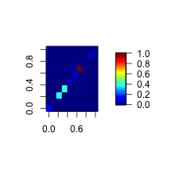
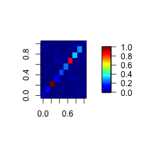
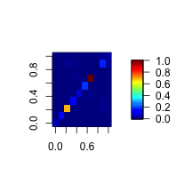
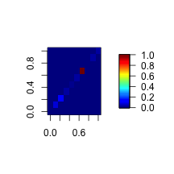
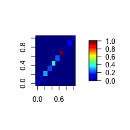
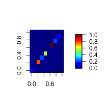
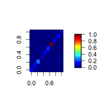

 
This is an example for how to run [backShift](http://arxiv.org/abs/1506.02494), 
an algorithm to estimate the connectivity matrix of a directed (possibly cyclic) 
graph with hidden variables. The underlying system is required to be linear and 
we assume that observations under different shift interventions are available.
 
In this example, we simulate a data set with the function 
`simulateInterventions()` provided in this package.
 
## Options
 
### Preliminaries
 
First, we load the `backShift` package as well as the packages `ggplot2` and 
`fields` which are needed to visualize the results. Additionally, we set the 
random seed for reproducability. 
 

```r
# load package
require(backShift)
require(ggplot2)
require(fields)
 
# set seed
seed <- 1
set.seed(seed)
```
 
### Algorithm
 
backShift exploits differences between covariance or Gram matrices. To use 
covariance matrices set `useCov` to `TRUE`.
 

```r
# use covariance matrix instead of Gram matrix
useCov <- TRUE 
```
 
### Stability selection
 
backShift estimates the connectivity matrix of a directed (possibly cyclic) 
graph. In order to control the number of falsly selected edges we can use 
[stability selection](http://arxiv.org/abs/0809.2932) which provides a finite 
sample control for the expected number of false discoveries.
If stability selection should not be used, set the parameter `EV` to 0.
 

```r
# bound on expected number of false selections for stability selection
EV <- 2
# selection threshold for stability selection
thres <- 0.75 
```
 
To visualize the point estimate of the connectivity matrix, the coefficients are 
thresholded at the absolute value given by `thres.pe`. So edges with coefficients 
smaller than `thres.pe` in absolute value are not displayed.
 

```r
# threshold for point estimate 
thres.pe <- 0.25
```
 
 
### Simulation
 
A data set can be simulated with `simulateInterventions()`. This function takes 
the true connectivity matrix as an input. A connectivity matrix can be 
generated with `generateA()` or you can use the connectivity matrix provided through `data("exampleAdjacencyMatrix")`.
 
#### Connectivity matrix
 
In the following code, we set whether we "provide" the adjacency matrix 
__A__ -- e.g. by loading the example with `data("exampleAdjacencyMatrix")` 
or by creating an adjacency matrix ourselves -- or whether we generate the 
connectivity matrix __A__ with `generateA()`.
 
NOTE: The entry __A__{_ij_} contains the edge from node _i_ to node _j_.
 

```r
# number of variables
p <- 10
 
# set whether to provide or to generate the adjacency matrix A 
providedA <- TRUE
 
if(providedA){
  data("exampleAdjacencyMatrix")
  A <- exampleAdjacencyMatrix
  p <- 10
}else{
  # parameters to generate A
  
  # should A be cyclic?
  cyclic <- TRUE
  # expected number of neighbors per node
  expNumNeigh <- 0.1*p 
  # range for coefficients
  minCoef <- 0.3
  maxCoef <- 0.8
  
  ## Generate A -------
  cat("Generating A...\n") 
  A.gen.result <- generateA(p, expNumNeigh, minCoef, maxCoef, cyclic)
  A <- A.gen.result$A
  cat("A has a cycle of size", A.gen.result$sizeCycle, "\n") 
}
```
 
#### Observations under different shift interventions
 
The following code generates a data set. In addition to the size of the data set, 
we can specify the following options: 
 
* whether to also simulate observational data (`simulateObs`), 
* whether hidden variables should be present (`hidden`)
* whether the location of the interventions should be known (`knownInterventions`; 
note that this is not needed for backShift)
* if `knownInterventions` is `TRUE`, `fracVarInt` gives the fraction of variables
that are intervened on in each environment
* `intMult` determines the magnitude of the intervention variances (please see the
[manuscript](http://arxiv.org/abs/1506.02494) for more details)
* `noiseMult` determines the noise variance
* `nonGauss` specifies whether to generate non-Gaussian noise
 
 

```r
# number of observations
n <- 10000
# number of environments
G <- 10 
# also simulate observational data?
simulateObs <- TRUE 
# should hidden vars be included?
hidden <- FALSE 
# should the location of the interventions be known?
knownInterventions <- FALSE 
# if the location of the interventions is known, how many vars. should
# be intervened on in each environment (as a fraction of p)
fracVarInt <- 0.5
# multiplier for interventions (m_I in manuscript)
intMult <- 1.5
# multiplier for interventions (m_e in manuscript)
noiseMult <- 1
# simulate non-Gaussian noise? 
nonGauss <- FALSE
 
## Simulate data -------
cat("Simulating the data...\n") 
simulation.res <- simulateInterventions(n, p, A, G, intMult, noiseMult, 
                                        nonGauss, hidden, knownInterventions, 
                                        fracVarInt, simulateObs, seed)
 
# extract X, environment vector and index of observational data
X <- simulation.res$X
env <- simulation.res$environment
baseInd <- simulation.res$configs$indexObservationalData
```
 
## Running backShift
 
We can now run backShift. Since we also generated observational data, we provide
the corresponding index as `baseInd`. This is useful for estimating the 
intervention variances (see below).
 

```r
## Run backShift -------
backshift.res <- backShift(X, env, covariance=useCov, ev=EV, threshold=thres, 
                        baseSettingEnv = baseInd, tolerance = 1e-6, 
                        verbose = FALSE)
```

```
## backShift: Percentage of runs in stability selection that converged: 100%
```
 
 
## Results
 
### Estimated graphs
 
Plot true graph:
 

```r
# extract estimates
Ahat <- backshift.res$Ahat
Ahat.structure <- backshift.res$AhatAdjacency
 
# compute performance metrics and plot result
cat("Plotting true graph... \n") 
plotGraphEdgeAttr(estimate = A, plotStabSelec = FALSE, labels = colnames(A), 
                  thres.point = 0, thres.stab = thres, main = "True graph")
```


 
Plot point estimate (thresholded at `thres.pe`): The edge intensity reflects the
relative magnitude of the coefficients. 
 

```r
cat("Plotting point estimate, thresholded at", thres.pe,"... \n") 
plotGraphEdgeAttr(estimate = Ahat, plotStabSelec = FALSE, labels = colnames(A), 
                  thres.point = thres.pe, thres.stab = thres, 
                  main = paste("Point estimate thresholded at", thres.pe))
```


 
Plot stability selection result: The edges thickness indicates how often an 
edge was selected in the stability selection procedure.
 

```r
cat("Plotting stability selection result... \n") 
plotGraphEdgeAttr(estimate = Ahat.structure, plotStabSelec = TRUE, 
                  labels = colnames(A), thres.point = thres.pe, 
                  edgeWeights = Ahat, thres.stab = thres, 
                  main = "Stability selection result")
```


 
### Metrics
 
`metricsThreshold` computes the structural hamming distance (SHD), 
true positive rate (TPR)/recall, false positive rate (FPR) and precision.
The connectivity matrix gets thresholded at `thres` prior to computing these metrics.
 

```r
# metrics for point estimate, thresholded at thres.pe
metricsThresholdedA <- metricsThreshold(A, Ahat, thres = thres.pe)
 
# metrics for stability selection result
metricsStabSelection <- metricsThreshold(A, Ahat.structure, thres = 0)
```
 

| Threshold| SHD| TPR/Recall| FPR| Precision|
|---------:|---:|----------:|---:|---------:|
|      0.25|   0|          1|   0|         1|


| Threshold| SHD| TPR/Recall| FPR| Precision|
|---------:|---:|----------:|---:|---------:|
|         0|   1|     0.9167|   0|         1|
 
## Estimating the intervention variances
 
The location and the strength of the shift interventions can be estimated from the
data (up to an offset if no observational data is present). 
These estimates are returned by the function `backShift()` as a 
_G_ x _p_- dimensional matrix `varianceEnv` where _G_ is the number of 
environments and _p_ is the number of variables. The _ij_-th entry contains the difference
between the estimated intervention variance of variable _j_ in environment _i_
and the estimated intervention variance of variable _j_ in the base setting
(given by input parameter `baseSettingEnv`).
 

```r
plotInterventionVars(backshift.res$varianceEnv, simulation.res$interventionVar)
```

 
 
 
## Checking the model assumptions
 
We can check the model assumptions to some extent by the success or failure of the joint 
diagonalization procedure. The plots below show that the joint diagonalization succeeded
for all environments as all matrices are diagonal. The values are scaled to [0,1] 
to allow for comparability accross plots.
 

```r
for(i in 1:G){
  plotDiagonalization(estConnectivity = backshift.res$Ahat, X = X, env = env, whichEnv = i)
}
```

          
