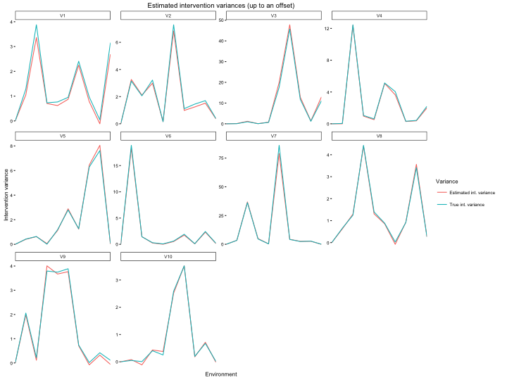

 
Example for running [backShift](http://arxiv.org/abs/1506.02494), an algorithm 
to estimate the connectivity
matrix of a directed (possibly cyclic) graph with hidden variables. The
underlying system is required to be linear and we assume that observations
under different shift interventions are available.
 
 
## Options
 
### Preliminaries
 

```r
# load package
require(backShift)
 
# set seed
seed <- 1
set.seed(seed)
```
 
### Algorithm
 
backShift exploits differences between covariance or Gram matrices. To use 
covariance matrices set `useCov` to `TRUE`.
 

```r
# use covariance matrix instead of Gram matrix
useCov <- TRUE 
```
 
### Stability selection
 
backShift can be run with or without [stability selection](http://arxiv.org/abs/0809.2932). 
If stability selection should not be used, set `EV` to 0.
 

```r
# bound on expected number of false selections for stability selection
EV <- 2
# selection threshold for stability selection
thres <- 0.75 
```
 
To visualize the point estimate of the connectivity matrix, the coefficients are 
thresholded at the absolute value given by `thres.pe`. So edges with coefficients 
smaller than `thres.pe` in absolute value are not displayed.
 

```r
# threshold for point estimate 
thres.pe <- 0.25
```
 
 
### Simulation
 
Simulate a data set with `simulateInterventions()` and `generateA()` or use the 
connectivity matrix provided through `data("exampleAdjacencyMatrix")`.
 
#### Connectivity matrix
 
Set whether to provide the adjacency matrix A -- e.g. by loading an example 
with `data("exampleAdjacencyMatrix")` or by creating an adjacency matrix yourself --
or whether to generate the connectivity matrix A with `generateA()`.
 
NOTE: The entry A_ij contains the edge from node i to node j.
 

```r
# number of variables
p <- 10
 
# set whether to provide or to generate the adjacency matrix A 
providedA <- TRUE
 
if(providedA){
  data("exampleAdjacencyMatrix")
  A <- exampleAdjacencyMatrix
  p <- 10
}else{
  # parameters to generate A
  
  # should A be cyclic?
  cyclic <- TRUE
  # expected number of neighbors per node
  expNumNeigh <- 0.1*p 
  # range for coefficients
  minCoef <- 0.3
  maxCoef <- 0.8
  
  ## Generate A -------
  cat("Generating A...\n") 
  A.gen.result <- generateA(p, expNumNeigh, minCoef, maxCoef, cyclic)
  A <- A.gen.result$A
  cat("A has a cycle of size", A.gen.result$sizeCycle, "\n") 
}
```
 
#### Observations under different shift interventions
 

```r
# number of observations
n <- 10000
# number of environments
G <- 10 
# also simulate observational data?
simulateObs <- TRUE 
# should hidden vars be included?
hidden <- FALSE 
# should the location of the interventions be known?
knownInterventions <- FALSE 
# if the location of the interventions is known, how many vars. should
# be intervened on in each environment (as a fraction of p)
fracVarInt <- 0.5
# multiplier for interventions (m_I in manuscript)
intMult <- 1.5
# multiplier for interventions (m_e in manuscript)
noiseMult <- 1
# simulate non-Gaussian noise? 
nonGauss <- FALSE
 
## Simulate data -------
cat("Simulating the data...\n") 
simulation.res <- simulateInterventions(n, p, A, G, intMult, noiseMult, 
                                        nonGauss, hidden, knownInterventions, 
                                        fracVarInt, simulateObs, seed)
 
# extract X, environment vector and index of observational data
X <- simulation.res$X
env <- simulation.res$environment
baseInd <- simulation.res$configs$indexObservationalData
```
 
## Running backShift
 

```r
## Run backShift -------
backshift.res <- backShift(X, env, covariance=useCov, ev=EV, threshold=thres, 
                        baseSettingEnv = baseInd, tolerance = 1e-6, 
                        verbose = FALSE)
```

```
## backShift: Percentage of runs in stability selection that converged: 100%
```
 
 
## Results
 
### Estimated graphs
 

```r
# extract estimates
Ahat <- backshift.res$Ahat
Ahat.structure <- backshift.res$AhatAdjacency
 
# compute performance metrics and plot result
cat("Plotting true graph... \n") 
plotGraphEdgeAttr(estimate = A, plotStabSelec = FALSE, labels = colnames(A), 
                  thres.point = 0, thres.stab = thres, main = "True graph")
```


 

```r
cat("Plotting point estimate, thresholded at", thres.pe,"... \n") 
plotGraphEdgeAttr(estimate = Ahat, plotStabSelec = FALSE, labels = colnames(A), 
                  thres.point = thres.pe, thres.stab = thres, 
                  main = paste("Point estimate thresholded at", thres.pe))
```


 

```r
cat("Plotting stability selection result... \n") 
plotGraphEdgeAttr(estimate = Ahat.structure, plotStabSelec = TRUE, 
                  labels = colnames(A), thres.point = thres.pe, 
                  edgeWeights = Ahat, thres.stab = thres, 
                  main = "Stability selection result")
```


 
### Metrics
 

```r
# metrics for point estimate, thresholded at thres.pe
metricsThresholdedA <- metricsThreshold(A, Ahat, thres = thres.pe)
 
# metrics for stability selection result
metricsStabSelection <- metricsThreshold(A, Ahat.structure, thres = 0)
```
 

| Threshold| SHD| TPR/Recall| FPR| Precision|
|---------:|---:|----------:|---:|---------:|
|      0.25|   0|          1|   0|         1|


| Threshold| SHD| TPR/Recall| FPR| Precision|
|---------:|---:|----------:|---:|---------:|
|         0|   1|     0.9167|   0|         1|
 
## Estimating the intervention variances
 

```r
plotInterventionVar(-backshift.res$varianceEnv, simulation.res$interventionVar^2)
```

 

```r
plotInterventionVar(-backshift.res$varianceEnv)
```

 
 
 
## Checking the model assumptions
